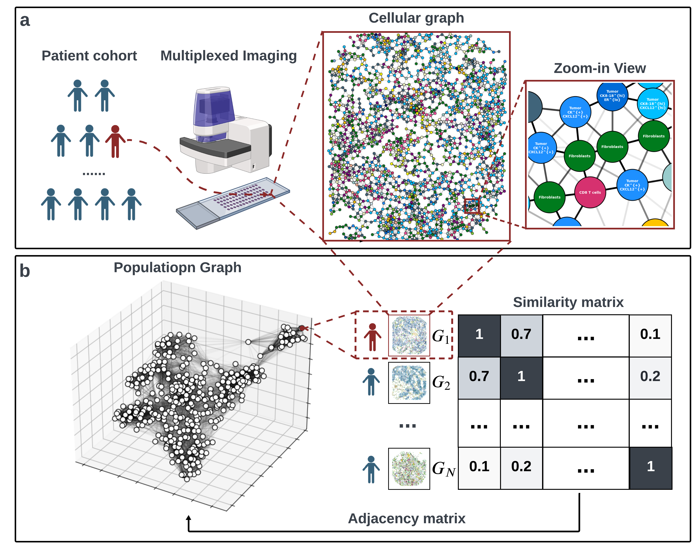

# BiGraph4TME
This repo is the official implementation for the `BiGraph` method introduced in *Bi-level Graph Learning Unveils Prognosis-Relevant Tumor Microenvironment Patterns in Breast Multiplexed Digital Pathology*. 

BiGraph is an unsupervised learning method for multi-scale discovery of tumor microenvironments (TME). It relies on the construction of a bi-level graph model: 
    
 (i) a cellular graph, that models the intricate tumor microenvironment, 

(ii) a population graph that captures inter-patient similarities, given their respective cellular graphs, by means of a **soft** Weisfeiler-Lehman (WL) subtree kernel.



# Install
```
git clone https://github.com/JasmineZhen218/BiGraph4TME.git
cd BiGraph4TME
python3 -m venv .venv
source .venv/bin/activate
pip install -r requirements.txt
```
# Reproduce figures in the paper
See [Demo/README.md](Demo/README.md)

# Apply to your Own Data
## 1. Data Preparation
Load and preprocess single-cell data (mandatory) and survival data (optional).
```
import pandas as pd
SC_d = pd.read_csv("path_to_single_cell_data_of_discovery_set.csv") 
SC_v = pd.read_csv("path_to_single_cell_data_of_validation_set.csv")  

# if survival data is available
survival_d = pd.read_csv(path_to_survival_data_of_discovery_set.csv") 
survival_v = pd.read_csv("path_to_survival_data_of_validation_set.csv") 

```
Preprocess data by conducting (user-defined) data inclusion, cleaning, normalization, etc. After preprocessing, each row in `SC_d` and `SC_v` represents a single cell, and it should at least include the following columns:
    
*  `patientID`: patient id; type: string or integer
*  `imageID`: image id, if each patient has only one image, this it is same as `patientID`; type: string or integer
*  `celltypeID`: cell type; type: integer
*  `coorX`: x coordinate of the cell's spatial location; type: float
* `coorY`: y coordinate of the cell's spatial location; type: float

If survival data is available, after preprocessing, each row in `survival_d` and `survival_v` represents a single patient, and it should at least include the following columns:

* `patientID`: patient id, which should match `patientID` in singleCell_d; type: string or integer
* `status`: Survival Status; type: integer. 
    * overall survival: 0: alive; 1: death
    * disease-specific survival: 0: alive; 1: disease-specific death
    * recurrence-free survival: 0: not recurrent; 1: recurrent
* `length`: survival time in months; type: float

Missing values in these required columns will raise errors.

## 2. Fit BiGraph model with discovery set
```
from bi_graph import BiGraph
bigraph_ = BiGraph()
population_graph, patient_subgroups = bigraph_.fit_transform(
    SC_d,
    survival_data = survival_d
)
```
### Hyperparameters for BiGraph model
* `a`: scaler in Gaussian kernel how edge weight decrease with cell-cell spatial distance increases. ($w = \text{exp}(-ad^2)$, where $w$ is edge weight, $d$ is cell-cell spatial distance in um). Default is 0.01.
* `n_iter`: number of iterations of graph convolution, controlling depth of explored subtrees. Default is 2.
* `k_subtree_clustering`: decide coarseness of subtree clustering. Default is 100.
*  `k_patient_clustering`: decide coarseness of patient clustering. Default is 30.
* `k_estimate`: number of nearest neighbors for estimating the patient subgroup for new patients (only useful in validation phases).
* `resolution`: decide coarseness of patient clustering. The default is 1.
*  `size_smallest_cluster`: number of patients in the smallest patient subgroup. Patient subgroups smaller than it will be discarded. The default is 10.
*  `threshold_hodges_lehmann`: determine the number of characteristic patterns for each patient subgroup, Default is 0.2.

 
## 3. Validate BiGraph model with validation set
```
population_graph_v, patient_subgroups_v, histograms_v, Signature_v = bigraph_.transform(
    SC_v,
    survival_data = survival_v
)

```

# Use Soft-WL subtree kernel without BiGraph

```
from soft_wl_subtree import Soft_WL_Subtree
from cell_graph import Cell_Graph 
cell_graph_ = Cell_Graph(a = 0.01)
Cell_graphs = cell_graph_.generate(SC_d)
soft_wl_subtree_ = Soft_WL_Subtree(n_iter = 2, k = 100, normalize = True)
Similarity_matrix = soft_wl_subtree_.fit_transform(
    Cell_graphs
)
```
#### Hyperparameters
For Cell_Graph()
*   `a`: scaler in Gaussian kernel how edge weight decrease with cell-cell spatial distance increases. ($w = \text{exp}(-ad^2)$, where $w$ is edge weight, $d$ is cell-cell spatial distance in um). Default is 0.01.

For Soft_WL_Subtree()
* `n_iter`: number of iterations of graph convolution (depth of subtree), the default is 2.
* `k`: decide coarseness of subtree clustering, the default is 100.
* `normalize`: wether normalize the similarity to [0,1] when comparing two cellular graphs, the default is True.
#### Retrive identified TME patterns
 ```
num_patterns = self.num_patterns # number of identified patterns
Signatures = self.Signatures # Signatures (i.e., cluster centroids of identified TME patterns, array: (n_pattern, n_feature))
Histograms = self.Histograms # Histogram of TME patterns for patients, [array: (n_patterns)]
```


# Citation
```
@article{wang2024bi,
  title={Bi-level Graph Learning Unveils Prognosis-Relevant Tumor Microenvironment Patterns from Breast Multiplexed Digital Pathology},
  author={Wang, Zhenzhen and Santa-Maria, Cesar A and Popel, Aleksander S and Sulam, Jeremias},
  journal={bioRxiv},
  pages={2024--04},
  year={2024},
  publisher={Cold Spring Harbor Laboratory}
}
```

